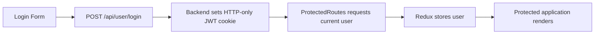

# BookMyShow Frontend

React/Vite frontend for the BookMyShow full-stack movie-ticket booking project.

[Live Demo](https://bookmyshow-frontend-ten.vercel.app) · [Full-Stack Repo](https://github.com/kvp9743/bookmyshowClone) · [Backend Repo](https://github.com/kvp9743/bookmyshow-backend) · [Backend Deployment](https://bookmyshow-backend-lrkh.onrender.com)

## Overview

This frontend handles movie discovery, date-based show selection, visual seat selection, Stripe Checkout redirection, booking history, theater-owner management, and administrator screens.

It communicates with the Express backend through a shared Axios instance configured with credentials enabled so the HTTP-only authentication cookie is sent with API requests.

## Tech Stack

- React 19
- Vite
- React Router
- Redux Toolkit / React Redux
- Tailwind CSS
- Ant Design
- Axios
- Moment.js

## Features

### Authentication
- Registration, login, and logout.
- Protected routes.
- Current-user data stored in Redux.
- Redirect to login when authentication fails.

### Movies and Shows
- Movie listing and title search.
- Movie detail page.
- Date-based show selection.
- Shows grouped by theater.

### Booking
- Visual numbered seating layout.
- Booked-seat and selected-seat states.
- Displayed total based on selected seats.
- Stripe-hosted Checkout redirect.
- Payment-success verification flow.

### Profile / Theater Owner
- Booking and ticket history.
- Add, edit, and delete theaters.
- Theater approval status.
- Show management for approved theaters.

### Admin
- Movie CRUD interface.
- Theater list.
- Theater approval/block controls.

## Main Routes

| Route | Purpose |
| --- | --- |
| /register | Create account |
| /login | Sign in |
| / | Movie listing |
| /movie/:id | Movie details and available shows |
| /bookShow/:id | Seat selection and booking |
| /profile | Tickets and owned theaters |
| /admin | Admin interface |
| /payment-success | Verify successful Stripe Checkout |
| /payment-cancelled | Payment cancellation page |

## Project Structure

```text
src/
├── Components/
├── Redux/
├── Services/
├── pages/
├── App.jsx
└── main.jsx
```

Redux is intentionally limited to global user and loader state. Movies, theaters, shows, selected seats, and form state remain local to their components.

## API Configuration

Axios uses the VITE_API_URL environment variable and withCredentials=true.

Local:
```env
VITE_API_URL=http://localhost:8080
```

Production:
```env
VITE_API_URL=https://bookmyshow-backend-lrkh.onrender.com
```

## Local Setup

```bash
git clone https://github.com/kvp9743/bookmyshow-frontend.git
cd bookmyshow-frontend
npm install
npm run dev
```

## Authentication Flow



The JWT is not stored in localStorage.

## Payment Flow

1. User selects seats.
2. Frontend sends showId and selectedSeats to the backend.
3. Backend returns a Stripe Checkout URL.
4. Browser redirects to Stripe-hosted Checkout.
5. Stripe redirects back with session_id.
6. Frontend sends the Session ID to the backend for verification.

## Deployment

Frontend: **https://bookmyshow-frontend-ten.vercel.app**

The included vercel.json rewrites SPA routes to index.html so React Router URLs work after browser refreshes.

## Related Repositories

- Full project: https://github.com/kvp9743/bookmyshowClone
- Backend: https://github.com/kvp9743/bookmyshow-backend

## Author

**Kiran Pawar** — https://github.com/kvp9743

---

> This repository is part of an independent educational project and is not affiliated with or endorsed by BookMyShow.